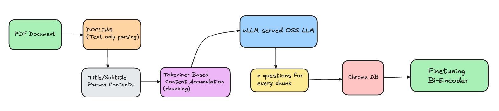

# Bespoke Document Embeddings

The motivation behind this project is to adapt pre-trained bi-encoder models to generate more contextual embeddings for a given document.

## Project Structure
```
bespoke_document_embeddings/
├── parser/                      # Document parsing module
│   ├── data/                    # Input PDF files
│   │   └── AWQ.pdf
│   ├── input/                   # Additional input directory
│   ├── output/                  # Parsed JSON outputs
│   │   ├── consolidated_parsed_output.json
│   │   ├── parsed_output.json
│   │   ├── table_of_contents.json
│   │   └── tokenizer_adjusted_parsed_output.json
│   └── docling_parser.py        # PDF parsing using Docling
│
├── question_generator/          # Question generation module
│   ├── output/                  # Generated questions output
│   │   └── parsed_content_with_questions.json
│   ├── generate_questions.py    # Main question generation logic
│   ├── llm_utils.py            # LLM utility functions
│   └── prompts.py              # System and user prompts
│
├── model_trainer/              # Model training and fine-tuning
│   ├── training_data/          # Training datasets
│   └── trainer.py              # BiEncoder model trainer
│
├── models/                     # Model storage and management
├── db/                         # Vector database storage
├── main.py                     # Main application entry point
├── pyproject.toml             # Project dependencies and configuration
└── uv.lock                    # Dependency lock file
```

## Architecture



## Prerequisites

- Python 3.13+
- Hugging Face account and token
- vLLM server running locally

## Installation

1. **Clone the repository**:
   ```bash
   git clone <repository-url>
   cd bespoke_document_embeddings
   ```

2. **Install dependencies**:
   ```bash
   uv sync
   ```

3. **Set up environment variables**:
   ```bash
   cp .env_example .env
   ```
   
   Edit `.env` and add your configuration:
   ```bash
   export HF_TOKEN=your_token
   export BI_ENCODER_MODEL_NAME=google/embeddinggemma-300m
   export CONTEXT_WINDOW=2000
   export CACHE_DIR=models
   export VLLM_CACHE_ROOT=models
   export TRAINED_MODEL_SAVE_DIR=models/finetuned_bi_encoder
   export HF_REPO_NAME=praveenramesh/awq_finetuned_embedding_gemma
    ```
4. **Activate virtual environment**:
   ```bash
   source .venv/bin/activate
   ```
   Activate virtual environment in two terminals, one for starting the vLLM server and another one for executing main.py

## Usage
Two terminals are required, one for LLM serving and one for executing the pipeling

### 1. Start vLLM Server

First, start the vLLM server with Llama model:

```bash
vllm serve meta-llama/Llama-3.2-3B-Instruct --max-model-len 3000 --max-num-batched-tokens 3000 --dtype auto --api-key praveen@123
```

### vLLM Server Configuration

The system expects a vLLM server running on `http://localhost:8000` with:
- Model: `meta-llama/Llama-3.2-3B-Instruct`
- API Key: `praveen@123`
- Max model length: 3000 tokens
- Max batched tokens: 3000


### 2. Run the Pipeline

Execute the main script to process a PDF and generate questions:

```bash
python main.py
```

**!!! Note : It is recommended to run in a GPU enabled instance, when executing main.py post creation of training data user will be prompted with "Terminate vllm manually, after killing it confirm by typing 'yes' : ", kill the vLLM server and confirm by typing 'yes' to continue to model training**

## Components

The system consists of four main components that work together to create bespoke document embeddings:

### 1. PDF Parser (`parser/docling_parser.py`)

**Purpose**: Converts PDF documents into structured, tokenizer-aware text chunks using Docling.

**Key Features**:
- Extracts structured content with section headers and page numbers
- Consolidates text by sections/headers
- Implements token-aware chunking based on model's context window
- Generates multiple output formats for downstream processing

**Sample Input**:
```
PDF file: parser/data/AWQ.pdf
Context window: 2000 tokens
Model: google/embeddinggemma-300m
```

**Sample Output**:
```json
{
  "ABSTRACT~1": {
    "start_page": 1,
    "text_contents": [
      "Large language models (LLMs) have transformed numerous AI applications. On-device LLM is becoming increasingly important: running LLMs locally on edge devices can reduce the cloud computing cost and protect users' privacy..."
    ]
  },
  "1 INTRODUCTION~1": {
    "start_page": 1,
    "text_contents": [
      "Deploying large language models (LLMs) directly on edge devices is crucial. On-device usage eliminates delays caused by sending data to a cloud server..."
    ]
  }
}
```

**Generated Files**:
- `table_of_contents.json` - Section headers with page numbers
- `parsed_output.json` - Raw Docling output
- `consolidated_parsed_output.json` - Text consolidated by sections
- `tokenizer_adjusted_parsed_output.json` - Token-aware chunked content

### 2. Question Generator (`question_generator/generate_questions.py`)

**Purpose**: Generates contextual questions from parsed document content using a locally served vLLM model.

**Key Features**:
- Uses Llama-3.2-3B-Instruct model via OpenAI-compatible API
- Generates multiple questions per text chunk
- Implements retry logic for failed generations
- Extracts structured JSON responses from LLM output

**Sample Input**:
```json
{
  "text_content": "Large language models (LLMs) have transformed numerous AI applications. AWQ finds that not all weights in an LLM are equally important. Protecting only 1% salient weights can greatly reduce quantization error."
}
```

**Sample Output**:
```json
{
  "ABSTRACT~1": {
    "start_page": 1,
    "text_with_questions": [
      {
        "text_content": "Large language models (LLMs) have transformed numerous AI applications...",
        "questions": [
          "What is the main goal of the proposed Activation-aware Weight Quantization (AWQ) approach?",
          "How does AWQ identify salient weight channels in a Large Language Model (LLM)?",
          "What is the benefit of using AWQ in terms of quantization error reduction?"
        ]
      }
    ]
  }
}
```

**Dependencies**:
- vLLM server running on `http://localhost:8000`
- Model: `meta-llama/Llama-3.2-3B-Instruct`
- API Key: `praveen@123`

### 3. Model Trainer (`model_trainer/trainer.py`)

**Purpose**: Fine-tunes bi-encoder models using question-document pairs with contrastive learning.

**Key Features**:
- Uses ChromaDB for vector storage and similarity search
- Implements Multiple Negatives Ranking Loss
- Generates training triplets (anchor question, positive document, negative documents)
- Supports model upload to Hugging Face Hub

**Training Process**:
1. **Embedding Generation**: Creates embeddings for all document chunks
2. **Training Data Preparation**: 
   - For each question, finds similar documents as negatives
   - Creates triplets: `{anchor: question, positive: source_text, negative: similar_text}`
3. **Model Fine-tuning**: Uses SentenceTransformer with contrastive loss

**Sample Training Data**:
```json
[
  {
    "anchor": "What is the main goal of AWQ?",
    "positive": "AWQ finds that not all weights in an LLM are equally important. Protecting only 1% salient weights can greatly reduce quantization error.",
    "negative": "Large language models have transformed numerous AI applications. On-device LLM is becoming increasingly important for privacy."
  }
]
```

**Training Configuration**:
- Base model: `google/embeddinggemma-300m`
- Training epochs: 5
- Batch size: 1
- Learning rate: 2e-5
- Loss function: MultipleNegativesRankingLoss

**Output**: Fine-tuned model saved to `models/finetuned_bi_encoder/`

### 4. Vector Database (`ChromaDB`)

**Purpose**: Stores document embeddings and enables similarity search for training data generation.

**Key Features**:
- Persistent storage in `db/` directory
- Efficient similarity search for negative sampling
- Metadata storage for document sections and page numbers

**Sample Database Entry**:
```json
{
  "id": "uuid-string",
  "document": "AWQ finds that not all weights in an LLM are equally important...",
  "embedding": [0.1, -0.2, 0.3, ...],
  "metadata": {
    "title": "ABSTRACT~1"
  }
}
```

### Component Interaction Flow

```
PDF Document → PDFParser → Structured JSON
     ↓
Structured JSON → QuestionGenerator → Questions + Text Pairs
     ↓
Questions + Text → BiEncoderTrainer → Training Data Triplets
     ↓
Training Triplets → Fine-tuning → Bespoke Embeddings Model
```

### Integration Points

- **Parser → Question Generator**: `tokenizer_adjusted_parsed_output.json`
- **Question Generator → Model Trainer**: `parsed_content_with_questions.json`
- **Model Trainer → ChromaDB**: Embeddings and similarity search
- **Model Trainer → HuggingFace**: Fine-tuned model upload

